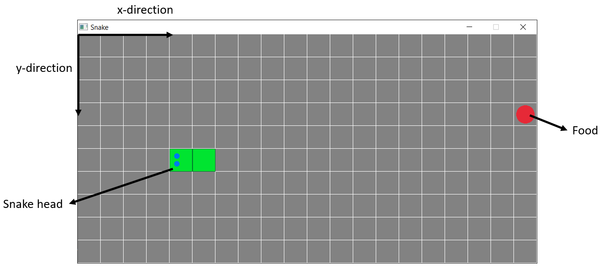

# Snake Project
Snake game coded in C++ using [raylib](https://www.raylib.com/) for rendering and [catch](https://github.com/catchorg/Catch2/tree/Catch1.x) for unit testing.

## How to play

In the picture there is a screenshot of the game window with annotations. The goal of the game is to control the snake using the left and right arrows keys to change directions and eat as many foods as possible while not eating itself. Each time a food is eaten, it respawn in another random location and the snake body grows by one cell. The game ends when the snake's head comes in collision with its body. It is possible to teleport across borders.

## Compile

After correctly installing raylib and its dependencies (in lib/ folder there is already the library compiled from windows), running the makefile will provide two executable: Snake and unit_tests.

- **Snake:** run to start the game, good luck! The total points acheived will be displayed in the terminal after game over.
- **unit_tests:** run to start unit tests for debugging and to check if the new feature added doesn't break the game.

## Implementation details

- **src/:**
    - **utils.hpp/cpp:** defines useful functions, struct and enums used in the project.
    - **snake.hpp/cpp:** defines snake class and related functions
    - **game.hpp/cpp:** defines game class and related functions. Responsible for the managing game variable/objects, handling of user inputs and rendering the game state.
- **test/:**
    - **unit_tests.cpp:** defines unit tests to check the proper operation of the game objects/functions in different scenarios.
- **main.cpp:** Defines the main loop of the game.
